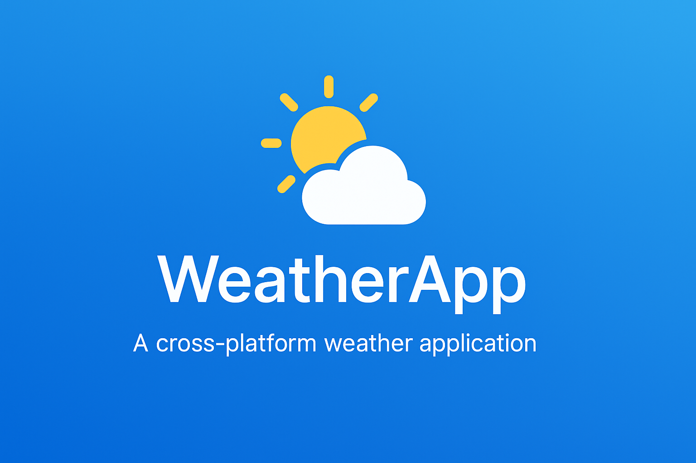
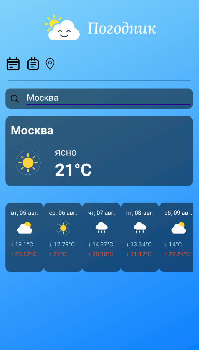
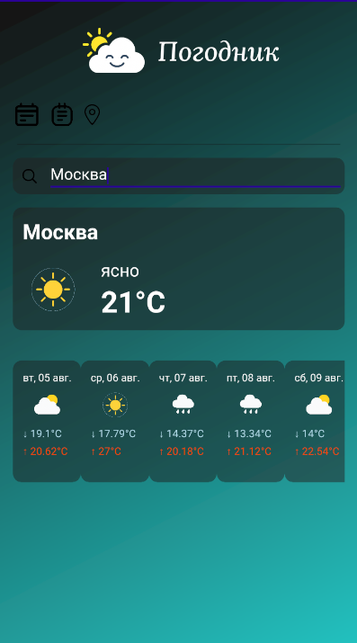

# 🌦️ **Pogodnik** — Weather App Template (.NET MAUI)

<p align="center">
  
</p>

> **🛠️ Полностью готовый шаблон погодного приложения на .NET MAUI.**  
> 🔥 Поддерживает Android, iOS, Windows и macOS.  
> Идеально для быстрой публикации, демонстрации в портфолио или продажи в сторах.

---

## 💡 Почему именно этот шаблон?

- ✅ Современный дизайн с поддержкой светлой и тёмной темы  
- ✅ Интеграция с OpenWeatherMap API  
- ✅ Геолокация в 1 клик  
- ✅ Чистая архитектура (MVVM + Dependency Injection)  
- ✅ Локализация: поддержка языков через `.resx`

---

## ⚙️ Основной функционал

| Возможность | Описание |
|------------|----------|
| 📍 Геолокация | Получение погоды по текущему местоположению |
| 🔎 Поиск города | Ввод и отображение прогноза по названию |
| 📅 Прогноз на 5 дней | Данные о температуре, погоде, иконки |
| 🌓 Темы оформления | Переключение между светлой и тёмной |
| 🌐 Мультиязычность | Локализация на русском, легко расширяется |
| 📱 Платформы | Android / iOS / Windows / macOS |

---

## 📸 Скриншоты приложения

| Светлая тема | Тёмная тема |
|--------------|-------------|
|  |  |

---

## 📁 Что входит

📂 WeatherApp/
├── Models/
├── Services/
├── ViewModels/
├── Views/
├── Resources/
├── Platforms/
├── App.xaml (+ Themes)
├── README.md, .gitignore, .csproj

---

## 🔌 Используемые технологии

- .NET MAUI (.NET 7/8/9)
- C# 11
- OpenWeatherMap API
- MAUI Essentials (Geolocation, Connectivity)
- MVVM Toolkit
- HttpClient, Json, Localization

---

## 🛒 Как приобрести

📩 Напишите мне:  
- Telegram: [@Gefakra](https://t.me/Gefakra)  
- Email: gefakra@gmail.com  

💳 Способы оплаты: Boosty / Карта / Crypto / По договоренности

> 🛍️ После оплаты вы получите архив проекта + помощь в сборке при необходимости.

---

## 🚀 Быстрый старт

```bash
git clone https://github.com/ВАШ-ПРОФИЛЬ/WeatherApp.git
cd WeatherApp
# Убедитесь, что у вас установлен .NET MAUI
dotnet build
